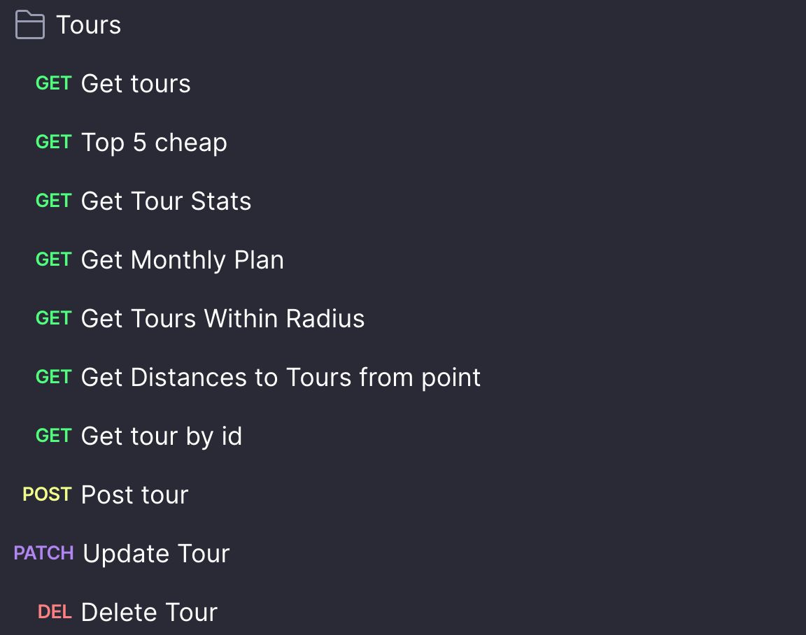
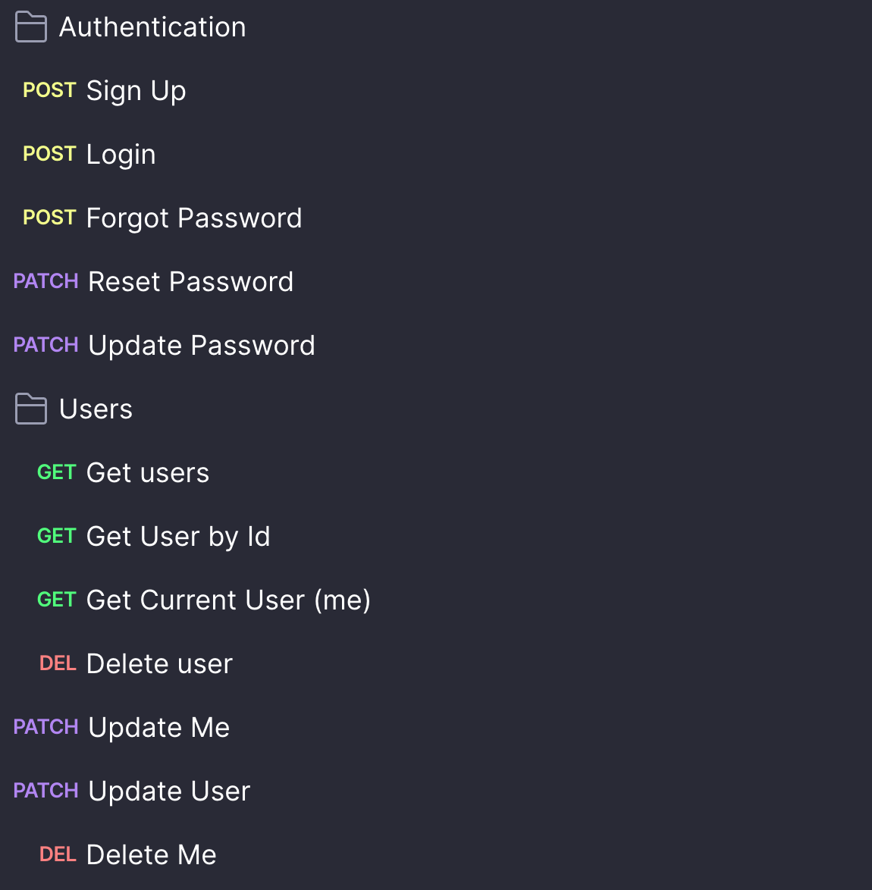
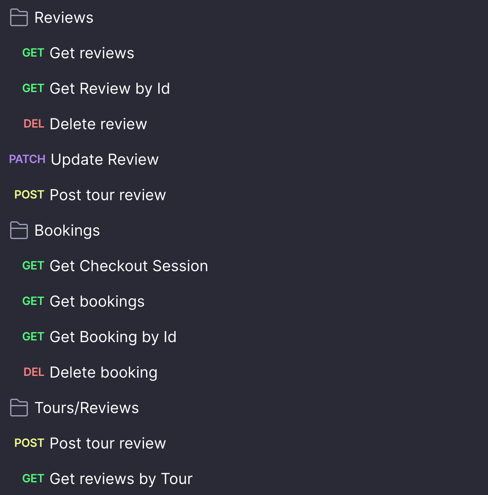
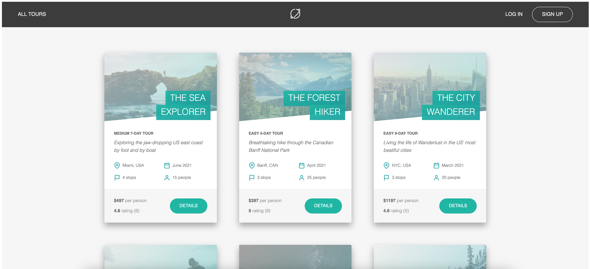
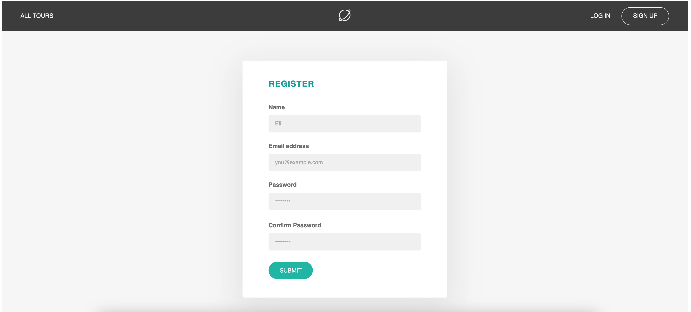
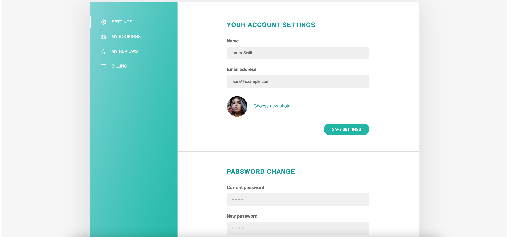
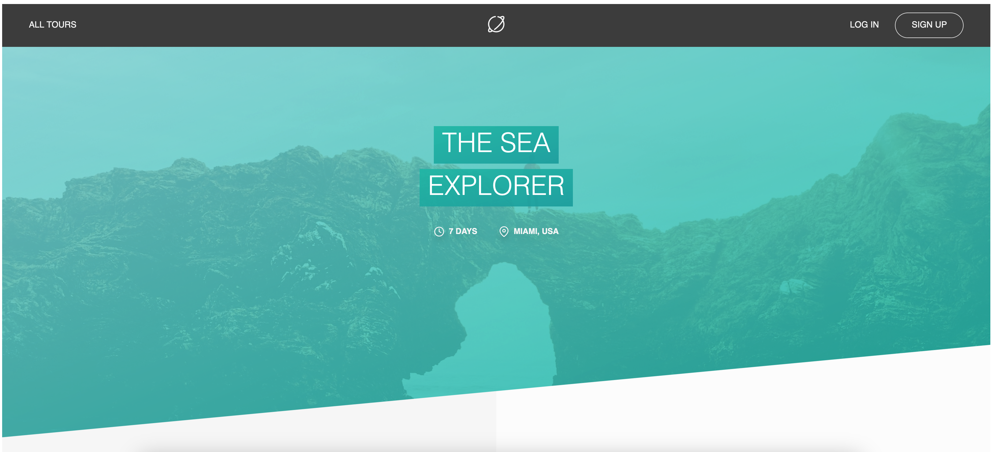
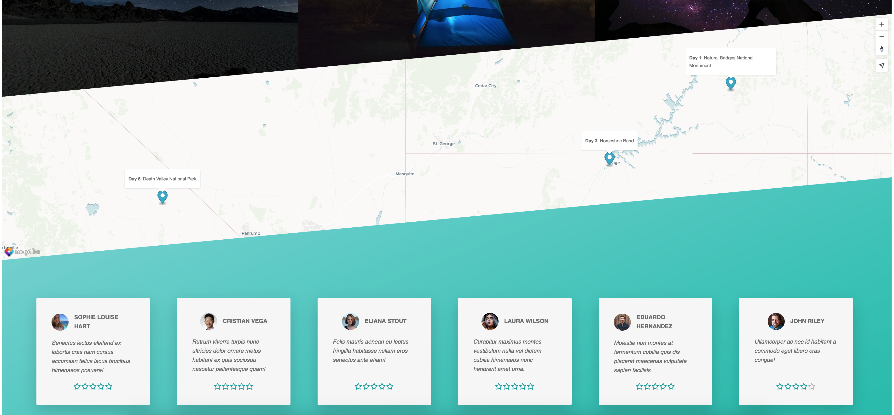
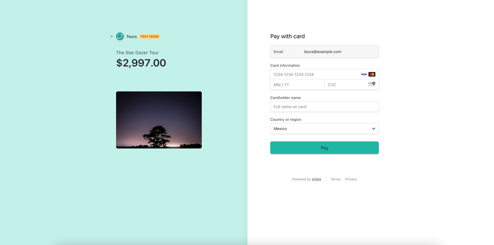
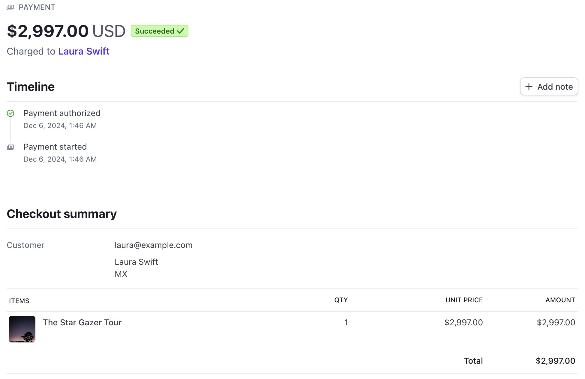

# Code along project [Udemy course](https://www.udemy.com/share/101Wv6/).

Web application for searching and booking tours, featuring an integrated RESTful API to manage tours, bookings, and user data. The main technologies used were Node.js, Express.js and MongoDB.

## Preview of the API:

## Preview of the application:

### Home page

### Register page

### Profile page

### Tour details page

### Booking tour page

Payment preview from stripe

